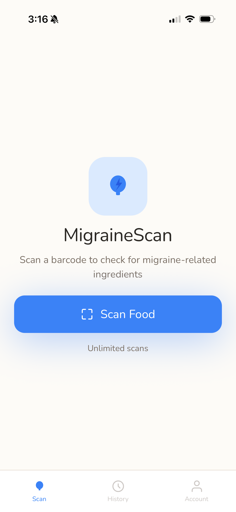
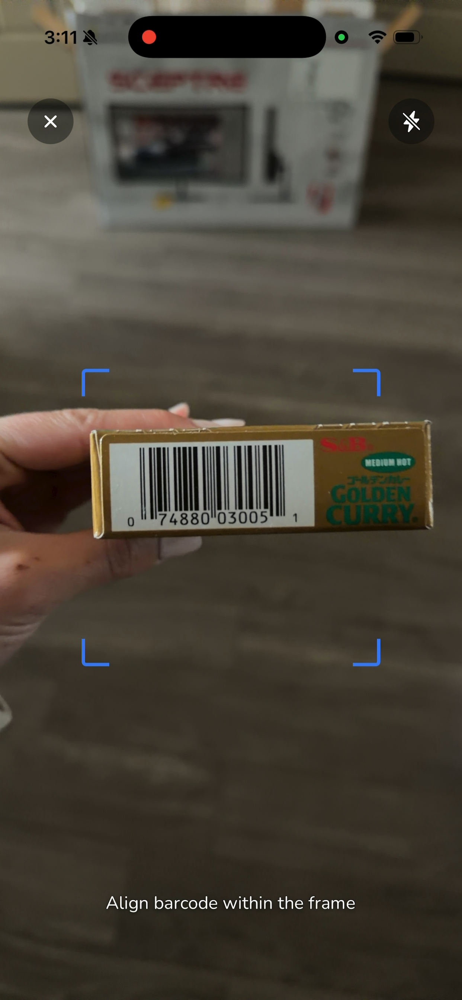
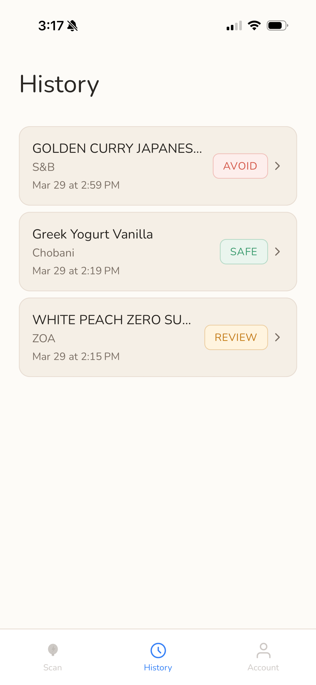
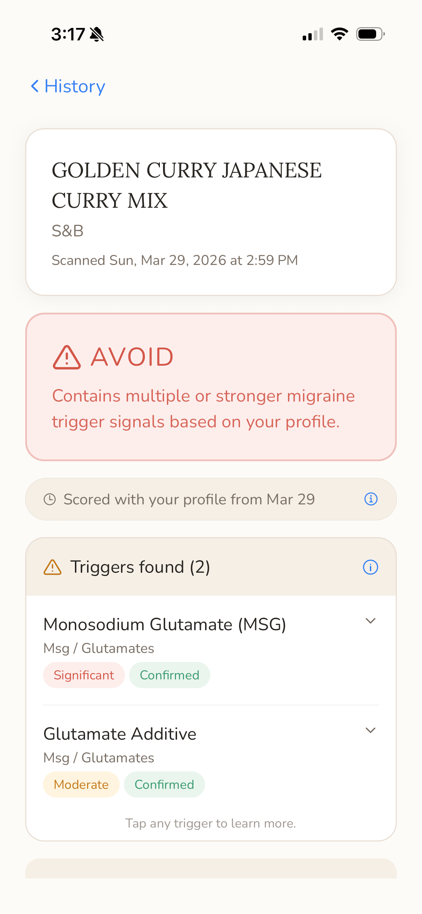
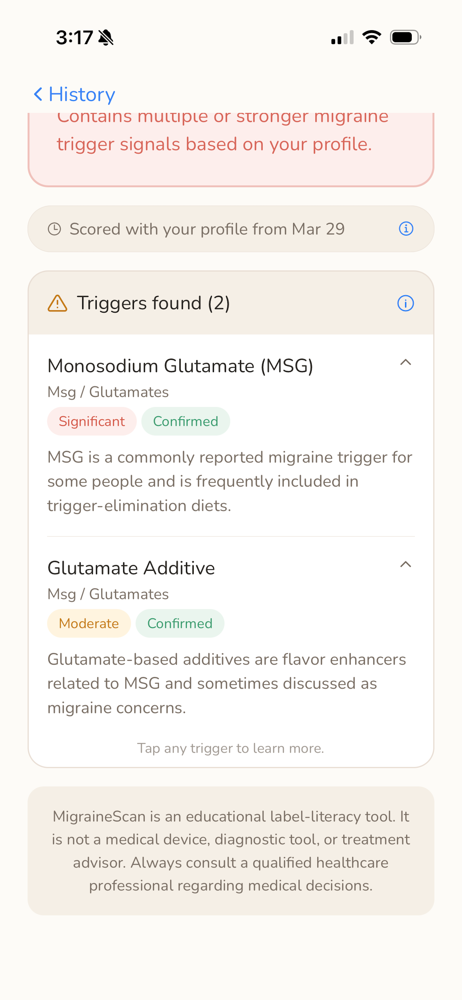

# MigraineScan

**A food-scanning iOS app that helps users identify ingredients commonly associated with migraine triggers.**

[View MigraineScan on the App Store](https://apps.apple.com/us/app/migrainescan/id6760956271)

MigraineScan is an independently designed and developed mobile application built with React Native, Expo, and TypeScript. Users can scan packaged-food barcodes and receive a personalized assessment based on the product's ingredients and their selected trigger sensitivities.

The application combines external product data with an ingredient preprocessing and scoring pipeline to turn raw food-label information into a simple **Safe / Review / Avoid** result.

<p align="center">
  
  
  
</p>

<p align="center">
  
  
</p>

> MigraineScan is an informational tool and is not intended to provide medical advice or diagnosis.

---

## Features

- **Barcode scanning** for packaged foods
- **Product lookup** using OpenFoodFacts
- **Ingredient analysis** through a normalization and scoring pipeline
- **Personalized trigger profiles** based on user-selected sensitivities
- **Safe / Review / Avoid assessments** with explanations for detected triggers
- **Scan history** persisted to Firestore
- **Email/password authentication**
- **Sign in with Apple**
- **Premium subscription support** through RevenueCat
- Responsive layouts for supported iOS devices

---

## How It Works

```text
Scan barcode
     ↓
Retrieve product data
     ↓
Normalize ingredient information
     ↓
Match ingredients against monitored triggers
     ↓
Apply the user's sensitivity profile
     ↓
Calculate assessment
     ↓
Display Safe / Review / Avoid result
```

Rather than displaying raw ingredient data alone, MigraineScan processes product information through a versioned scoring pipeline. Scan records preserve the scoring-model and preprocessing versions used at the time of evaluation.

---

## Tech Stack

| Area                  | Technology                                  |
| --------------------- | ------------------------------------------- |
| Mobile                | React Native                                |
| Language              | TypeScript                                  |
| Framework             | Expo                                        |
| Authentication        | Firebase Authentication, Sign in with Apple |
| Database              | Cloud Firestore                             |
| Product Data          | OpenFoodFacts                               |
| Subscriptions         | RevenueCat                                  |
| Navigation            | React Navigation                            |
| Local Persistence     | AsyncStorage                                |
| Builds / Distribution | Expo Application Services (EAS)             |

---

## Engineering Highlights

### Ingredient Processing & Scoring

Product ingredient data is normalized before evaluation so that ingredient variations can be compared consistently against the application's monitored trigger definitions.

The scoring system combines detected ingredients with the user's configured sensitivity profile to produce a personalized result rather than applying the same assessment to every user.

Results are presented as **Safe**, **Review**, or **Avoid**, with detected triggers organized by severity and confidence. Individual triggers can be expanded to provide additional context behind the assessment.

### Typed Data Model

The application uses TypeScript throughout the codebase for product data, user profiles, trigger configuration, scan results, and persisted Firestore records.

Scan-history records retain information such as:

- detected triggers
- severity and confidence
- sensitivity applied at scan time
- scoring-model version
- preprocessing version

This allows historical results to preserve the context in which they were generated.

### Authentication & Persistence

MigraineScan supports both email/password authentication and Sign in with Apple through Firebase Authentication.

Authentication state persists across application launches using AsyncStorage, while user profiles and scan history are stored in Cloud Firestore.

Firestore security rules restrict user documents and scan history to the authenticated owner.

### Subscription Management

Premium subscription functionality is integrated through RevenueCat, including:

- subscription status
- available offerings
- purchases
- purchase restoration
- account management

The integration fails gracefully when native purchase functionality is unavailable, allowing the rest of the application to continue operating.

### Error Handling

User-facing authentication and purchase errors are mapped to understandable messages rather than exposing raw service errors.

External-service failures are handled so that failures in non-critical functionality do not prevent the application from launching.

---

## Security & Configuration

Environment-specific configuration is kept outside the repository.

Create a local `.env` file using `.env.example` as a reference:

```env
EXPO_PUBLIC_FIREBASE_API_KEY=
EXPO_PUBLIC_FIREBASE_AUTH_DOMAIN=
EXPO_PUBLIC_FIREBASE_PROJECT_ID=
EXPO_PUBLIC_FIREBASE_STORAGE_BUCKET=
EXPO_PUBLIC_FIREBASE_MESSAGING_SENDER_ID=
EXPO_PUBLIC_FIREBASE_APP_ID=

EXPO_PUBLIC_REVENUECAT_API_KEY_IOS=

EXPO_PUBLIC_OPENFOODFACTS_USER_AGENT=
```

Firebase service files and local environment files are excluded from version control.

---

## Running Locally

### Prerequisites

- Node.js
- npm
- Expo development environment
- iOS Simulator or compatible physical device

### Setup

```bash
git clone https://github.com/tamotoyama/migrainescan.git
cd migrainescan
npm install
```

Create a `.env` file using `.env.example`, then start the development server:

```bash
npm start
```

To run the native iOS project:

```bash
npm run ios
```

Some functionality, including native purchases and Sign in with Apple, requires an appropriate native development build and service configuration.

---

## Project Status

MigraineScan is an independently developed application released for iOS.

**App Store:**  
https://apps.apple.com/us/app/migrainescan/id6760956271

---

## About the Project

I built MigraineScan as an end-to-end product, working across application architecture, UI implementation, authentication, persistent data, external API integration, ingredient-processing logic, subscriptions, testing and debugging, and the iOS build/release process.

The project gave me the opportunity to take a product from an initial concept through implementation and distribution while making the technical and product decisions required to support a real mobile application.
